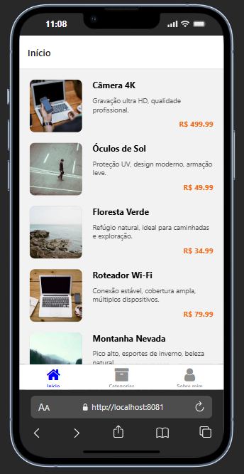

# Loja da Rai


<p align="center">
  
  
</p>

## Sobre o Projeto

Este projeto faz parte dos estudos da tecnologia **React Native** e foi desenvolvido como uma atividade da plataforma de ensino **B7Web**. Trata-se de um aplicativo mobile de loja, onde é possível visualizar produtos, categorias e informações do desenvolvedor.

## Tecnologias Utilizadas

- React Native
- Expo
- Expo Router
- TypeScript
- @expo/vector-icons (FontAwesome)
- React Native Safe Area Context
- React Native Screens
- Expo Linking
- Expo Constants

## Estrutura do Projeto

- Listagem de produtos e categorias
- Visualização de detalhes do produto
- Tela "Sobre mim" com redes sociais
- Navegação por abas

## Como Executar

1. Instale as dependências:
   ```
   npm install
   ```
2. Inicie o projeto:
   ```
   npx expo start
   ```
3. Para rodar no Android:
   ```
   npx expo start --android
   ```
4. Para rodar no navegador:
   ```
   npx expo start --web
   ```

---

Projeto desenvolvido para fins de aprendizado e prática de React Native.
